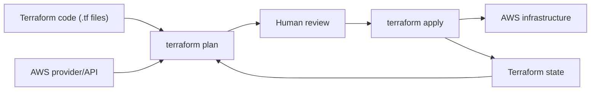

# Day 1: Terraform Foundations and First AWS Workflow

Welcome to Day 1.

Today is about building the right mental model. Terraform is not just a command line tool. It is a way to describe infrastructure, review the change, create it safely, and keep a record of what exists.

## Day 1 Outcome

By the end of Day 1, you should be able to:

- Explain Infrastructure as Code in simple words.
- Install and verify Terraform.
- Explain providers, resources, state, plan, apply, and destroy.
- Configure Terraform to talk to AWS.
- Run a local Terraform warm-up project.
- Read an AWS EC2 plan before applying it.
- Clean up resources to avoid AWS cost.

## The Problem Before Terraform

Imagine a team creates infrastructure manually in the AWS console:

- One engineer creates an EC2 instance.
- Another engineer adds a security group rule.
- Someone creates an S3 bucket during an incident.
- A database subnet setting changes at midnight.
- Nobody updates documentation.

After a few weeks, the team does not fully know what exists, why it exists, who changed it, or how to recreate it.

That is the problem Infrastructure as Code solves.

## What Is Infrastructure as Code?

Infrastructure as Code, or IaC, means infrastructure is described in files instead of being created only by clicking in a cloud console.

With IaC, infrastructure can be:

- Version controlled in Git.
- Reviewed before changes happen.
- Reused across environments.
- Recreated after failures.
- Audited by security and platform teams.
- Automated in CI/CD pipelines.

For a DevOps engineer, this is a career-changing habit: treat infrastructure changes with the same discipline as application code.

## What Is Terraform?

Terraform is an Infrastructure as Code tool created by HashiCorp. You write configuration files using HCL, which stands for HashiCorp Configuration Language.

Terraform follows a declarative model.

That means you describe the final state you want:

```hcl
resource "aws_instance" "web" {
  ami           = "ami-example"
  instance_type = "t3.micro"
}
```

You do not write every step such as "click here, then click there, then wait, then copy this ID." Terraform works out the steps by comparing:

- Your configuration files.
- The Terraform state file.
- The real infrastructure in AWS.

## Terraform Mental Model



The most important sentence for Day 1:

Terraform creates a plan by comparing what your code wants with what the state says exists and what the provider can see.

## Core Terms

| Term | Simple Meaning | Example |
| --- | --- | --- |
| Provider | Plugin that lets Terraform talk to a platform | AWS provider |
| Resource | Infrastructure object managed by Terraform | EC2 instance, S3 bucket, VPC |
| Data source | Read-only lookup from a provider | Find latest Amazon Linux AMI |
| State | Terraform's memory of managed resources | `terraform.tfstate` |
| Plan | Preview of what Terraform will do | Create 1 EC2 instance |
| Apply | Execute the approved plan | Actually create EC2 |
| Destroy | Remove resources from the config/state | Delete lab EC2 |
| Variable | Input value for flexible code | `region = "ap-south-1"` |
| Output | Value shown after apply | Instance ID |
| Module | Reusable Terraform package | EC2 module |

## Why State Matters From Day 1

Beginners often think the most important file is only `main.tf`.

In real Terraform, state is just as important.

State tells Terraform which real cloud resources belong to your code. Without state, Terraform may not know that an EC2 instance already exists. In a team, local state becomes risky because every engineer can have a different copy.

For Day 1, local state is acceptable because we are learning.

For production, we will later use:

- S3 for remote state.
- DynamoDB for state locking.
- CI plan checks for review.

This is why we never commit `terraform.tfstate` to Git.

## Install Terraform

### Windows

Use one of these methods:

```powershell
winget install Hashicorp.Terraform
```

Or download it from:

```text
https://developer.hashicorp.com/terraform/downloads
```

Then verify:

```powershell
terraform version
```

### macOS

```bash
brew tap hashicorp/tap
brew install hashicorp/tap/terraform
terraform version
```

### Linux

Use the official package instructions from HashiCorp:

```text
https://developer.hashicorp.com/terraform/install
```

Then verify:

```bash
terraform version
```

## Install AWS CLI

AWS CLI lets you authenticate your machine with AWS and test your identity before Terraform runs.

Install guide:

```text
https://docs.aws.amazon.com/cli/latest/userguide/getting-started-install.html
```

Verify:

```bash
aws --version
```

## AWS Account Setup

For serious learning, avoid using the AWS root user.

Create or use an IAM identity with only the permissions needed for the lab. For Day 1 EC2 practice, you need permissions around:

- EC2 read operations.
- EC2 instance creation and termination.
- Security group creation and deletion.
- Tagging resources.

In a beginner sandbox account, students often use broader permissions at first. That is acceptable only in a learning account, not in production.

## Configure AWS CLI

Use a named profile so your Terraform commands are explicit:

```bash
aws configure --profile terraform-day1
```

You will enter:

- AWS access key ID.
- AWS secret access key.
- Default region, such as `ap-south-1` or `us-east-1`.
- Output format, such as `json`.

Verify the profile:

```bash
aws sts get-caller-identity --profile terraform-day1
```

If this command fails, Terraform will also fail. Fix AWS authentication first.

## Terraform Project Anatomy

A small project usually starts like this:

```text
project-name/
|-- versions.tf
|-- providers.tf
|-- main.tf
|-- variables.tf
|-- outputs.tf
`-- terraform.tfvars.example
```

| File | Purpose |
| --- | --- |
| `versions.tf` | Terraform and provider version constraints |
| `providers.tf` | Provider configuration |
| `main.tf` | Main resources and data sources |
| `variables.tf` | Inputs |
| `outputs.tf` | Useful results after apply |
| `terraform.tfvars.example` | Example values students can copy locally |

## Terraform Workflow

Run these commands in this order.

### 1. Format

```bash
terraform fmt
```

This keeps HCL style consistent.

### 2. Initialize

```bash
terraform init
```

This downloads provider plugins and prepares the working directory.

### 3. Validate

```bash
terraform validate
```

This checks whether the configuration is structurally valid.

### 4. Plan

```bash
terraform plan
```

This previews what Terraform will create, update, or destroy.

### 5. Apply

```bash
terraform apply
```

Only type `yes` after reading the plan.

### 6. Destroy

```bash
terraform destroy
```

Use this for temporary learning resources so you do not keep paying for them.

## How To Read A Plan

Terraform uses symbols to show actions:

| Symbol | Meaning |
| --- | --- |
| `+` | Create |
| `~` | Update in place |
| `-/+` | Replace |
| `-` | Destroy |

Day 1 rule:

If you see a destroy or replace action that you do not understand, stop.

## Day 1 Labs

### Lab 00: Local Warm-Up

Path:

```text
day-01/labs/00-local-warmup
```

This lab creates a local text file using Terraform. It teaches the workflow without touching AWS.

Use this lab first if you are brand new.

### Lab 01: First AWS EC2

Path:

```text
day-01/labs/01-aws-first-ec2
```

This lab creates a small EC2 instance using the default VPC.

It is intentionally simple:

- No SSH key.
- No public inbound ports.
- Encrypted root volume.
- IMDSv2 required.
- Tags included.

The point is to learn the Terraform workflow, not to expose a server to the internet.

## Professional Habits From Day 1

Use these habits every time:

- Keep one project per folder.
- Use `terraform fmt` before commit.
- Use `terraform validate` before plan.
- Read the plan before apply.
- Use named AWS profiles.
- Put account-specific values in local `.tfvars` files.
- Commit `.terraform.lock.hcl` when it is generated.
- Never commit state files.
- Destroy temporary learning resources.

## Day 1 Completion Checklist

You are done with Day 1 when you can answer these without reading:

- What problem does Infrastructure as Code solve?
- What is a Terraform provider?
- What is a Terraform resource?
- Why does Terraform need state?
- What does `terraform init` do?
- Why should you run `terraform plan` before `terraform apply`?
- How do you verify your AWS CLI identity?
- Why should `terraform.tfstate` not be committed?

## Assignment

1. Run Lab 00 and create the local file.
2. Destroy Lab 00 resources.
3. Configure AWS CLI with a named profile.
4. Run `terraform plan` for Lab 01.
5. If the plan looks correct and you are in a sandbox AWS account, apply Lab 01.
6. Capture the EC2 instance ID from outputs.
7. Destroy Lab 01 resources.
8. Write three lines in your own notes:
   - What Terraform created.
   - What state means.
   - What you will never commit to Git.

