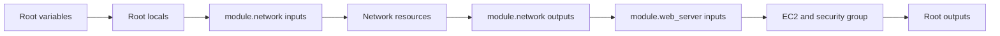

# Day 3: Reusable Infrastructure With Terraform Modules

Welcome to Day 3.

Day 1 taught the Terraform workflow. Day 2 taught providers, variables, outputs, data sources, and a custom VPC. Day 3 teaches how to package Terraform code so you can reuse it without copy-paste.

This is the day Terraform starts feeling like engineering instead of a collection of files.

## Day 3 Outcome

By the end of Day 3, you should be able to:

- Explain what a Terraform module is.
- Identify root modules and child modules.
- Create a local module with inputs and outputs.
- Pass values from a root module into a child module.
- Read outputs from a child module.
- Decide when a module is useful and when it is unnecessary.
- Refactor a VPC and EC2 project into reusable modules.
- Understand how module paths appear in Terraform state.

## The Problem Modules Solve

On Day 2, the VPC web server project was readable, but all logic lived in one root module folder.

That is fine for one project.

But imagine you now need:

- One VPC for dev.
- One VPC for stage.
- One VPC for prod.
- A web server pattern reused by multiple teams.
- Consistent tags and names everywhere.
- A safer way to update the network design once.

Copying the same Terraform files into many folders creates drift. One folder gets a fix, another folder does not. A new student changes the security group in one place and forgets the others.

Modules solve that by letting you write infrastructure logic once and call it with different inputs.

## What Is A Module?

A Terraform module is a folder containing Terraform files.

Every Terraform folder is a module.

The folder where you run Terraform commands is the root module. A module called from another module is a child module.

```text
root-module/
|-- main.tf
|-- variables.tf
|-- outputs.tf
`-- modules/
    `-- network/
        |-- main.tf
        |-- variables.tf
        `-- outputs.tf
```

The root module calls the child module:

```hcl
module "network" {
  source = "./modules/network"

  name_prefix        = local.name_prefix
  vpc_cidr           = var.vpc_cidr
  public_subnet_cidr = var.public_subnet_cidr
}
```

## Root Module vs Child Module

| Module Type | Meaning | Example |
| --- | --- | --- |
| Root module | Folder where you run `terraform init`, `plan`, and `apply` | `day-03/labs/01-modular-vpc-web-server` |
| Child module | Folder called by another module | `modules/network` |
| Local module | Child module stored in the same repo | `source = "./modules/network"` |
| Registry module | Module downloaded from Terraform Registry | `terraform-aws-modules/vpc/aws` |

## Module Contract

A good module has a clear contract.

The contract answers:

- What inputs does this module need?
- What resources does this module create?
- What outputs does this module return?
- What assumptions does this module make?
- What should users not configure directly?

In Terraform files, the contract usually lives in:

```text
variables.tf
outputs.tf
README.md
```

## Inputs

Inputs are variables declared inside the child module.

Example inside `modules/network/variables.tf`:

```hcl
variable "vpc_cidr" {
  description = "CIDR block for the VPC."
  type        = string
}
```

The root module passes a value:

```hcl
module "network" {
  source   = "./modules/network"
  vpc_cidr = var.vpc_cidr
}
```

## Outputs

Outputs return useful values from the child module back to the root module.

Example inside `modules/network/outputs.tf`:

```hcl
output "vpc_id" {
  value = aws_vpc.this.id
}
```

The root module reads it:

```hcl
vpc_id = module.network.vpc_id
```

This is how modules connect to each other without hardcoding IDs.

## Module Data Flow



## What Goes Into A Module?

A module should usually represent a reusable infrastructure capability.

Good module ideas:

- Network module.
- EC2 web server module.
- S3 static website module.
- IAM role module.
- ECS service module.
- Monitoring alarm module.

Weak module ideas:

- A module for one tag.
- A module for one line of code.
- A module used only once and unlikely to grow.
- A module that hides important behavior from students.

Day 3 rule:

Create a module when it reduces meaningful duplication or gives a clear reusable boundary.

## Module Folder Standard

A clean module usually looks like this:

```text
module-name/
|-- README.md
|-- main.tf
|-- variables.tf
`-- outputs.tf
```

For larger modules, split by concern:

```text
module-name/
|-- README.md
|-- data.tf
|-- compute.tf
|-- security.tf
|-- variables.tf
`-- outputs.tf
```

Use split files when it improves reading. Terraform loads all `.tf` files in a folder together.

## Module Source Types

Common source patterns:

| Source | Example | Use Case |
| --- | --- | --- |
| Local path | `./modules/network` | Same repo learning and internal modules |
| Git URL | `git::https://github.com/org/repo.git//module` | Shared private module repo |
| Registry | `terraform-aws-modules/vpc/aws` | Mature public modules |

For this course, Day 3 uses local modules so students understand the mechanics before using registry modules.

## Modules And State

Terraform state records module addresses.

A resource in the root module might look like:

```text
aws_vpc.this
```

A resource inside a child module might look like:

```text
module.network.aws_vpc.this
```

That address matters. If you move resources between root and modules after creation, Terraform can think resources were deleted and recreated unless state is moved carefully.

For Day 3 learning, create modular code before applying it.

## Provider Inheritance

Child modules usually inherit the provider configuration from the root module.

Root module:

```hcl
provider "aws" {
  region  = var.aws_region
  profile = var.aws_profile
}
```

Child modules can use AWS resources without declaring a new provider block.

This keeps provider configuration centralized.

## Day 3 Labs

### Lab 00: Local Module Basics

Path:

```text
day-03/labs/00-local-module-basics
```

This lab does not create AWS resources. It builds a simple naming module and shows how root modules pass inputs and read outputs.

### Lab 01: Modular VPC Web Server

Path:

```text
day-03/labs/01-modular-vpc-web-server
```

This lab refactors Day 2 thinking into two local modules:

- `modules/network`
- `modules/web_server`

The root module connects them.

## Professional Habits For Day 3

- Keep modules small enough to understand.
- Give every module a README.
- Use descriptive input and output names.
- Do not hide risky defaults.
- Avoid module chains that are hard to trace.
- Pin provider versions in the root module.
- Commit `.terraform.lock.hcl` from the root module.
- Run `terraform validate` before sharing module changes.

## Day 3 Completion Checklist

You are done with Day 3 when you can answer these:

- What is the root module?
- What is a child module?
- How does a root module pass values into a child module?
- How does a root module read values from a child module?
- Why can modules reduce environment drift?
- When should you avoid creating a module?
- What does a module resource address look like in state?
- Why is moving existing resources into modules risky without state planning?
