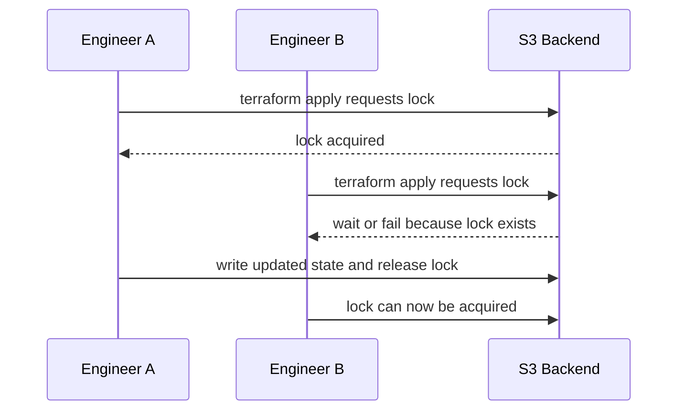

# Day 4: State, Backends, Locking, and Team Workflow

Welcome to Day 4.

Day 1 taught the Terraform workflow. Day 2 built AWS infrastructure. Day 3 introduced modules. Day 4 teaches the part that makes Terraform safe for teams: state management.

This is the day students stop treating `terraform.tfstate` as a random generated file and start treating it as Terraform's source of memory.

## Day 4 Outcome

By the end of Day 4, you should be able to:

- Explain what Terraform state stores.
- Inspect state with Terraform CLI commands.
- Explain why local state is acceptable for learning but risky for teams.
- Explain what a backend does.
- Bootstrap an S3 bucket for remote state.
- Understand S3 backend locking with `use_lockfile = true`.
- Understand why DynamoDB locking is now legacy/deprecated for the S3 backend.
- Practice the steps for migrating local state to an S3 backend.
- Explain drift and how teams detect it.

## Why State Exists

Terraform compares three things:

- Your configuration files.
- The real infrastructure in the provider.
- Terraform state.

State maps Terraform resource addresses to real infrastructure objects.

Example address:

```text
module.network.aws_vpc.this
```

Example real object:

```text
vpc-0123456789abcdef0
```

Without state, Terraform cannot reliably know which real object belongs to which resource block.

## What State Can Contain

State can include:

- Resource IDs.
- Provider metadata.
- Attribute values.
- Output values.
- Dependency information.
- Sensitive values if a provider stores them in attributes.

Day 4 rule:

Never commit `terraform.tfstate` to Git.

## Local State

By default, Terraform stores state locally:

```text
terraform.tfstate
```

Local state is fine for:

- First learning.
- Throwaway local labs.
- Personal experiments.

Local state is risky for teams because:

- Every person can have a different copy.
- A laptop can be lost.
- State can be accidentally committed.
- Two people can apply changes without coordination.
- Recovery is harder.

## Remote State

Remote state stores Terraform state outside your laptop.

For AWS projects, a common backend is S3.

Benefits:

- One shared state location.
- Versioning for recovery.
- Better access control through IAM.
- Safer team workflow.
- Locking support to prevent overlapping writes.

## Modern S3 Backend Locking

Modern Terraform S3 backend locking can use an S3 lock file:

```hcl
terraform {
  backend "s3" {
    bucket       = "my-state-bucket"
    key          = "app/terraform.tfstate"
    region       = "ap-south-1"
    use_lockfile = true
  }
}
```

The lock file appears next to the state object with a `.tflock` suffix while Terraform holds the lock.

## DynamoDB Locking Note

Older Terraform S3 backend examples often use DynamoDB for locking:

```hcl
dynamodb_table = "terraform-locks"
```

That pattern existed for a long time and you will still see it in old projects.

Current HashiCorp S3 backend documentation says DynamoDB-based locking is deprecated and will be removed in a future minor version. For this course, we teach S3 native lock files as the modern default.

## Backend Bootstrapping Problem

Terraform needs a backend bucket before it can store state in that bucket.

That creates a small chicken-and-egg problem:

1. Use local state to create the backend bucket.
2. Add S3 backend configuration to the real project.
3. Run `terraform init -migrate-state`.
4. Terraform copies state from local to S3.

This is normal.

## Backend Configuration Safety

Do not put secrets in backend configuration.

Avoid this:

```hcl
access_key = "..."
secret_key = "..."
```

Prefer AWS profiles, environment variables, or IAM roles.

## State Locking Mental Model



Locking makes changes ordered and predictable.

## Drift

Drift means real infrastructure no longer matches Terraform configuration and state.

Examples:

- Someone edits a security group in the AWS console.
- Someone deletes an EC2 instance manually.
- A tag is changed outside Terraform.
- A route table is modified during an incident.

Terraform detects drift during refresh and plan.

Professional teams catch drift with:

- Pull request plans.
- Scheduled plan checks.
- Restricted console access.
- Change review.

## Useful State Commands

| Command | Purpose |
| --- | --- |
| `terraform state list` | List tracked resources |
| `terraform state show ADDRESS` | Show one tracked resource |
| `terraform output` | Show root outputs from state |
| `terraform refresh` | Refresh state only; use carefully |
| `terraform plan -refresh-only` | Review drift without proposing config changes |
| `terraform init -migrate-state` | Move state to a new backend |

## Team Workflow

A healthy Terraform team workflow looks like this:

1. Engineer creates a branch.
2. Engineer changes Terraform code.
3. CI runs `terraform fmt -check` and `terraform validate`.
4. CI runs `terraform plan` and attaches the output to review.
5. Team reviews the plan.
6. Apply happens from a controlled place.
7. State is stored remotely with locking enabled.

## Day 4 Labs

### Lab 00: Local State Lifecycle

Path:

```text
day-04/labs/00-local-state-lifecycle
```

This lab creates a local file and teaches state inspection commands.

### Lab 01: S3 Backend Bootstrap

Path:

```text
day-04/labs/01-s3-backend-bootstrap
```

This lab creates a protected S3 bucket for Terraform remote state.

### Lab 02: S3 Backend Migration Practice

Path:

```text
day-04/labs/02-s3-backend-migration-practice
```

This lab shows how to migrate a simple local-state project to S3 using `terraform init -migrate-state`.

## Professional Habits For Day 4

- Never commit state files.
- Enable S3 bucket versioning for state recovery.
- Enable encryption for state buckets.
- Block public access on state buckets.
- Use S3 lock files with `use_lockfile = true`.
- Keep backend credentials out of Terraform code.
- Treat state migration as a reviewed operation.
- Do not move resources into modules after apply without state planning.

## Day 4 Completion Checklist

You are done with Day 4 when you can answer these:

- What does Terraform state remember?
- Why is local state risky for teams?
- What does a backend do?
- Why should state buckets have versioning?
- What does `use_lockfile = true` do?
- Why is DynamoDB locking considered legacy for S3 backend now?
- What command migrates state to a new backend?
- What is drift?
- How should teams review Terraform plans?
